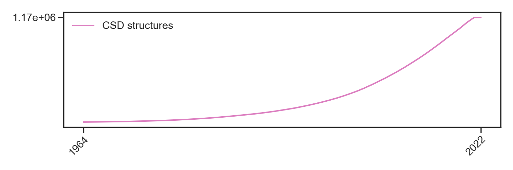
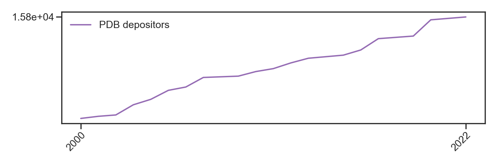
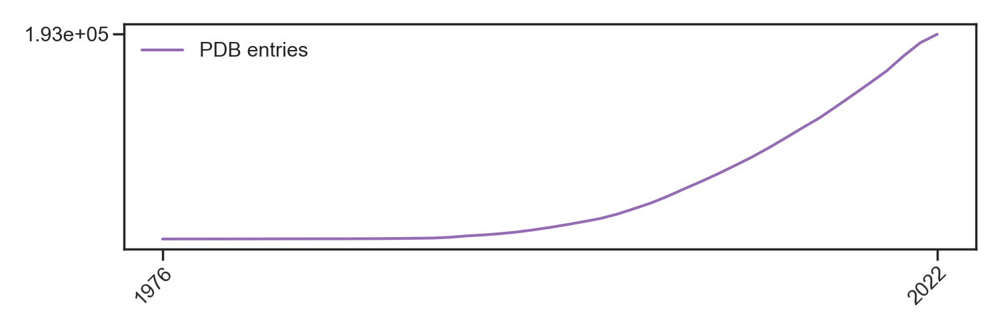
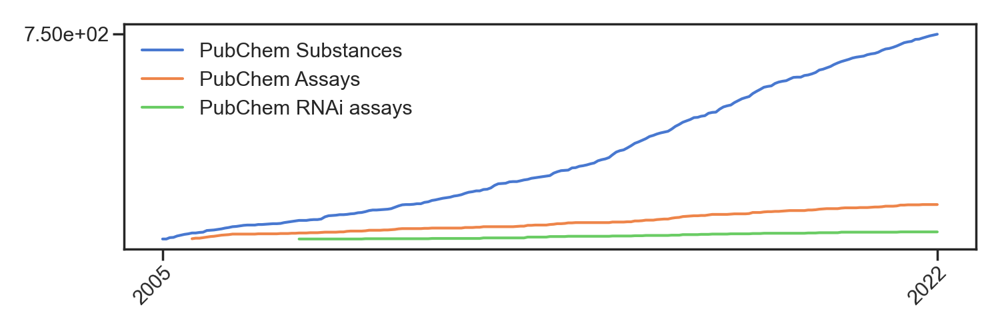
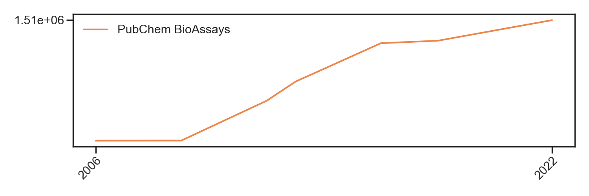
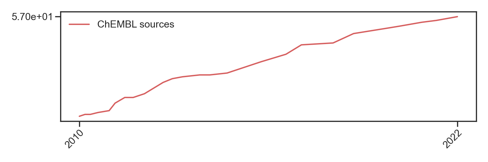
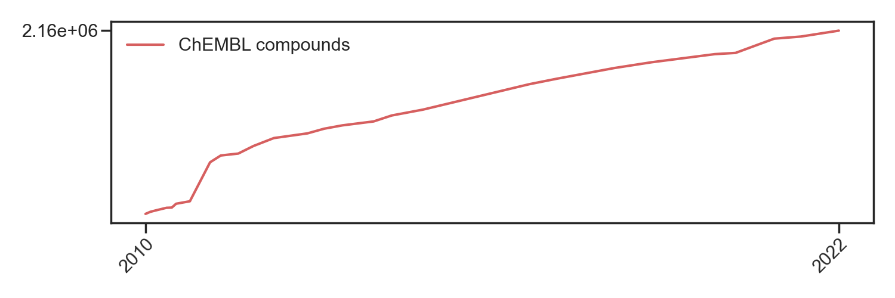

# data-sharing-perspective
Data and scripts to generate figures for the perspective "Data sharing in chemistry: lessons learned and a case for mandating structured reaction data" by R Mercado, S Kearnes, and CW Coley.

## Environment
You can use a conda environment to run the plotting scripts in this repo. To set up the environment, run:
```
conda create -n data-sharing-perspective seaborn -c anaconda
conda activate data-sharing-perspective`
```

## Generating plots
To create the plot for figures 1 and 2 in the manuscript, run:
```
python plot-entries.py
python plot-contributors.py
```

The first script will plot data entries over time and the second script will plot contributors/sources over time, for the following databases:
* [CSD](https://www.ccdc.cam.ac.uk/solutions/software/csd/)
* [PDB](https://www.rcsb.org/)
* [PubChem](https://pubchem.ncbi.nlm.nih.gov/)
* [ChEMBL](https://www.ebi.ac.uk/chembl/)

Files will be created in [plots/](./plots/).

## Illustrator files
Files used for making the figures shown in the paper are available in [illustrator/](./illustrator/). Made using Adobe Illustrator.

## Raw data
The raw data for the above plots is available in [data/](./data/). For individual sources, see below:

### CSD
Structures available in the CSD (cumulative):

Data collected from:
* [CCDC documentation](https://www.ccdc.cam.ac.uk/media/Documentation/9DA399C5-90F8-478E-9C41-EAFD1868ED31/9da399c590f8478e9c41eafd1868ed31.pdf)

### PDB
Depositors for data in the PDB (cumulative):

Entries available in the PDB (cumulative)

Data collected from:
* [PDB Annual Depositors](https://www.wwpdb.org/stats/deposition)

### PubChem
Sources for data in PubChem (cumulative):

Data entries in PubChem (cumulative):

Data collected from:
* PubChem [publications page](https://pubchem.ncbi.nlm.nih.gov/docs/publications) where I got the data count for PubChem Compounds, BioAssays, and Substances:
  - [2005](https://www.genome.gov/15014443/2005-release-nih-nationwide-network-of-molecular-libraries-screening-centers)
  - [2006](http://triggered.edina.clockss.org/ServeContent?url=http%3A%2F%2Fmolinterv.aspetjournals.org%2Fcontent%2F6%2F5%2F240.full.pdf%2Bhtml)
  - [2007](https://bmcbioinformatics.biomedcentral.com/articles/10.1186/1471-2105-9-401)
  - [2007](https://chempedia.info/info/nih_molecular_libraries_roadmap_initiative/)
  - [2008](https://www.sciencedirect.com/science/article/abs/pii/S1574140008000121?via%3Dihub)
  - [2009](https://academic.oup.com/nar/article/37/suppl_2/W623/1155303?login=false)
  - [2012](https://academic.oup.com/nar/article/40/D1/D400/2903189?login=false#55480751)
  - [2013 & 2016](https://academic.oup.com/nar/article/45/D1/D955/2605812?login=false)
  - [2018](https://academic.oup.com/nar/article/47/D1/D1102/5146201?login=false)
  - [2021](https://academic.oup.com/nar/article/49/D1/D1388/5957164?login=false)
  - [2022](https://pubchem.ncbi.nlm.nih.gov/docs/statistics)\*

\* Accessed Dec 25, 2022.

### ChEMBL
Sources (documents) for data in ChEMBL (cumulative):

Compound entries in ChEMBL (cumulative):

Data collected from:
* Breakdown of all data sources in the [release notes](https://chembl.gitbook.io/chembl-interface-documentation/downloads)

### Links to icons used in paper figures
Flaticon images linked here (used freely with attribution): [1](https://www.flaticon.com/free-icon/data-science_9850843), [2](https://www.flaticon.com/free-icon/laptop_9006060?term=translator&page=1&position=94&origin=search&related_id=9006060), [3](https://www.flaticon.com/free-icon/aggregation_9850779), [4](https://www.flaticon.com/free-icon/big-data_9872410), [5](https://www.flaticon.com/free-icon/cloud-database_8637228), [6](https://www.flaticon.com/free-icon/document_2140758?related_id=2140758), [7](https://www.flaticon.com/free-icon/loupe_751463?term=magnifying+glass&page=1&position=1&origin=search&related_id=751463), [8](https://www.flaticon.com/free-icon/data-science_7760592), [9](https://www.flaticon.com/free-icon/unstructured-data_9850860?related_id=9850860&origin=search), [10](https://www.flaticon.com/free-icon/robot_9151271?related_id=9151271), [11](https://www.flaticon.com/free-icon/laboratory_250181?term=scientist&page=1&position=5&origin=search&related_id=250181)
