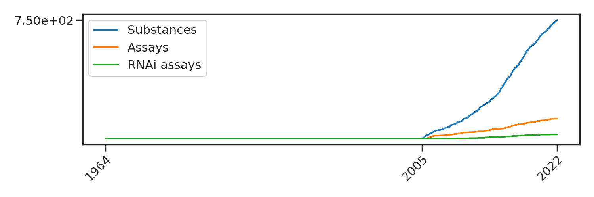
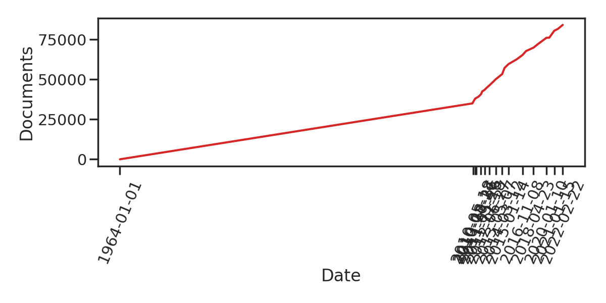
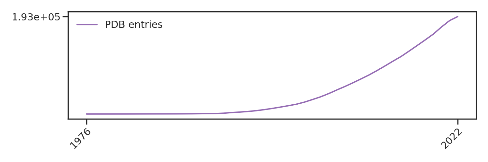
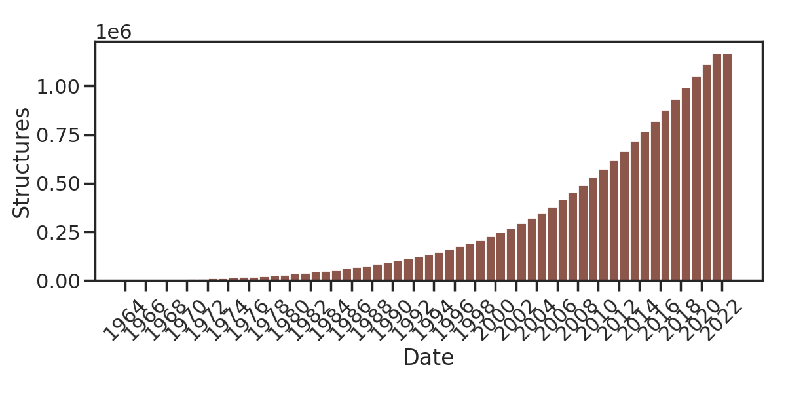

# data-sharing-perspective
Data and scripts to generate figures for the data-sharing perspective.

## Environment
Begin by creating a conda environment in which to run the following scripts:

```
conda create -n data-sharing-perspective seaborn -c anaconda
conda activate data-sharing-perspective
```

## Data sources for data in PubChem (cumulative)

* PubChem [publications page](https://pubchem.ncbi.nlm.nih.gov/docs/publications) where I got the data count for PubChem Compounds, BioAssays, and Substances:
  - [2005](https://www.genome.gov/15014443/2005-release-nih-nationwide-network-of-molecular-libraries-screening-centers)
  - [2006](http://triggered.edina.clockss.org/ServeContent?url=http%3A%2F%2Fmolinterv.aspetjournals.org%2Fcontent%2F6%2F5%2F240.full.pdf%2Bhtml)
  - [2007](https://bmcbioinformatics.biomedcentral.com/articles/10.1186/1471-2105-9-401)
  - [2007](https://chempedia.info/info/nih_molecular_libraries_roadmap_initiative/)
  - [2008](https://www.sciencedirect.com/science/article/abs/pii/S1574140008000121?via%3Dihub)
  - [2009](https://academic.oup.com/nar/article/37/suppl_2/W623/1155303?login=false)
  - [2012](https://academic.oup.com/nar/article/40/D1/D400/2903189?login=false#55480751)
  - [2013 & 2016](https://academic.oup.com/nar/article/45/D1/D955/2605812?login=false)
  - [2018](https://academic.oup.com/nar/article/47/D1/D1102/5146201?login=false)
  - [2021](https://academic.oup.com/nar/article/49/D1/D1388/5957164?login=false)
  - [2022](https://pubchem.ncbi.nlm.nih.gov/docs/statistics) (took numbers on Dec 25, 2022)

## Documents (publications) from which data is sourced in ChEMBL (cumulative)

* Add data on non-publication sources (see email)
* Breakdown of ALL data sources in the release notes [here](https://chembl.gitbook.io/chembl-interface-documentation/downloads)
* See email from Fiona Hunterf or cource information

## Entries available in the PDB (cumulative)

* [Here](https://www.wwpdb.org/stats/deposition) it is broken down by # of annual depositors, which is more relevant (end of page)
* [PDB Annual Depositors](https://www.wwpdb.org/stats/deposition)

## Structures available in the CSD (cumulative)

* Is there any data on num authors per year? (somewhat related, but not exactly desired, data [here](https://www.ccdc.cam.ac.uk/support-and-resources/ccdcresources/6297f7b0ac4d4d5ca48a7cbd463159fc.pdf))
* New link since CCDC website update: https://www.ccdc.cam.ac.uk/media/Documentation/9DA399C5-90F8-478E-9C41-EAFD1868ED31/9da399c590f8478e9c41eafd1868ed31.pdf
